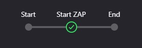
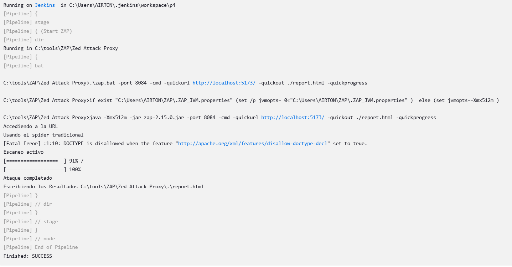

## Pruebas Funcionales
Las pruebas funcionales realizadas validan dos aspectos clave del sistema:

1. Envío de datos correctos al backend (TestCase2.test.jsx)
2. Validación de datos incompletos o inválidos en el formulario de pago (TestCase3.test.jsx)

### 1. Envío de datos correctos al backend

Archivo de testeo: TestCase2.test.jsx

Descripción:

Esta prueba asegura que los datos del formulario de checkout, cuando son válidos, se envíen correctamente al backend utilizando el método postPaymentPaypal.

Pasos de la prueba:

-Simular el envío de un formulario con datos válidos.

-Verificar que la función preventDefault del evento fue llamada para evitar la recarga de la página.

-Validar que los datos fueron enviados correctamente al endpoint /payment/create-order del servidor con la estructura esperada.

Objetivo:

-Garantizar que el sistema pueda procesar pedidos y enviar datos correctos al backend.

Código clave:
                expect(postPaymentPaypal).toHaveBeenCalledWith(
                  `${URL_SERVER}/payment/create-order`,
                  {
                    productList: [ { name: "producto1" }, { name: "producto2" } ],
                    checkoutData: validCheckoutData,
                  }
                );
### 2. Validación de datos incompletos o inválidos en el formulario de pago
Archivo de testeo: TestCase3.test.jsx

Descripción:
Esta prueba verifica que el sistema no permita el procesamiento de pagos si los datos ingresados en el formulario son inválidos o incompletos.

Pasos de la prueba:

-Simular el envío de un formulario con datos inválidos (como un email mal formado o un número de DNI no válido).
-Verificar que se muestre un modal de error con un mensaje descriptivo.
-Comprobar que la función checkoutValidationsModal sea llamada con los parámetros correctos.

Objetivo:
Evitar que el sistema procese pagos con datos incorrectos, garantizando la integridad y seguridad de las transacciones.

Código clave:

expect(checkoutValidationsModal).toHaveBeenCalledWith({title: "Error en el ingreso de datos", text: "Por favor, complete correctamente todos los campos.", icon: "warning", confirmButtonColor: "black",});
                
Resumen de las Pruebas Funcionales

| **Función Probada**                     | **Descripción**                                                                                           | **Resultado Esperado**                                                                                  | **CHECK** |
|-----------------------------------------|-----------------------------------------------------------------------------------------------------------|----------------------------------------------------------------------------------------------------------|-----------|
| **Envío de datos al backend**           | Verifica que los datos válidos del formulario se envíen correctamente al backend usando `postPaymentPaypal`. | Los datos enviados deben coincidir con la estructura esperada y ser recibidos correctamente por el servidor. | ✔️        |
| **Validación de email**                 | Asegura que el campo de email solo acepte direcciones con formato válido.                                  | Muestra un modal de error si el email no es válido.                                                      | ✔️        |
| **Validación de DNI**                   | Comprueba que el DNI tenga un formato válido (solo números).                                               | Muestra un modal de error si el DNI contiene letras o tiene una longitud incorrecta.                      | ✔️        |
| **Validación de teléfono celular**      | Valida que el número de celular tenga un formato válido (9 dígitos).                                       | Muestra un modal de error si el número de celular tiene un formato incorrecto.                            | ✔️        |
| **Validación de campos obligatorios**   | Verifica que todos los campos obligatorios estén llenos antes de permitir el envío del formulario.          | Muestra un modal de error si algún campo obligatorio está vacío.                                          | ✔️        |
| **Manejo del evento preventDefault**    | Garantiza que la página no se recargue al enviar el formulario.                                            | `event.preventDefault` debe ser llamado correctamente.                                                    | ✔️        |
| **Manejo de modal de validación**       | Asegura que el modal se muestre con el mensaje correcto cuando los datos son inválidos.                    | Se muestra un modal con el título "Error en el ingreso de datos" y un mensaje descriptivo.                | ✔️        |

Pipeline script:

    pipeline {
      agent any
  
      environment {
          NODEJS_HOME = '/usr/local/bin/node' // Cambia según tu instalación de Node.js
          PATH = "${NODEJS_HOME}:${env.PATH}"
      }
  
      stages {
          stage('Checkout') {
              steps {
                  script {
                      // Clona desde un repositorio o accede directamente al directorio
                      dir('INGRESA AQUI LA DIREECIÓN DEL PROYECTO') {
                          echo 'Using project from local directory...'
                      }
                  }
              }
          }
          stage('Run Tests') {
              steps {
                  script {
                      dir('INGRESA AQUI LA DIREECIÓN DEL PROYECTO') {
                          sh 'npm test'
                      }
                  }
              }
          }
      }
  
      post {
          always {
              echo 'Pipeline finished.'
          }
          success {
              echo 'Tests passed!'
          }
          failure {
              echo 'Tests failed.'
          }
      }
    }
En caso de realizar todo correctamente en "Stages" de Jenkins se debería visualizar lo siguiente:

## Pruebas de Rendimiento
El objetivo principal de Apache JMeter es realizar pruebas de rendimiento y carga en aplicaciones web y otros servicios. Es una herramienta de código abierto diseñada para evaluar y medir el rendimiento, la capacidad de respuesta y la estabilidad de las aplicaciones bajo diferentes cargas de usuarios. 
##Informe de Pruebas de Carga con JMeter
El presente informe detalla los resultados y configuraciones obtenidos durante las pruebas de rendimiento realizadas con JMeter sobre tres escenarios funcionales del sistema bajo prueba (SUT). A continuación, se describe cada caso evaluado, así como su porcentaje de participación en la carga total.

| Escenario          | URL                       | Usuarios | Ramp-Up | Ciclos | Total Solicitudes | Duración Aceptable | % Carga Total |
|--------------------|---------------------------|----------|---------|--------|-------------------|--------------------|---------------|
| Ver Producto| /product/{id}             | 200      | 20s     | 2      | 400               | 1s              | 56.76%        |
| Crear Producto Almacen     | /product-warehouse| 5        | 1s      | 2      | 10                | 2s            | 1.42%         |
| Crear Orden   | /order | 150      | 10s     | 3      | 450               | 3s             | 63.82%               |
| TOTAL   | - | 355    | -   | -      | -              | 860           | 100%     |

## Errores Generales:

El porcentaje global de errores (1.98%) está dentro de un rango aceptable, aunque el escenario CrearProductoAlmacen requiere atención debido a su tasa elevada de 10%.
Cumplimiento de Tiempos:
El escenario CrearOrden tiene los mayores tiempos de respuesta (promedio de 5.91 ms) y el mayor número de incidentes superando límites, indicando una posible optimización necesaria en este proceso.

## Resultados
El grupo ha analizado los resultados obtenidos con una carga de 860 usuarios, donde se presentó una tasa de fallos del 1.98%, equivalente a 17 fallos en total. Si bien estos resultados son aceptables para esta cantidad de usuarios, hemos considerado que si se aumentara el número de usuarios a 1200, el número de fallos podría aumentar proporcionalmente, alcanzando aproximadamente 24 fallos, lo que representaría un incremento de 7 fallos adicionales.
Aunque los resultados actuales son adecuados para esta cantidad de usuarios, recomendamos realizar más pruebas en el futuro si se considera necesario escalar la carga o si se identifican problemas de rendimiento adicionales. Esto permitirá asegurar que la infraestructura siga siendo capaz de manejar mayores volúmenes de tráfico sin afectar la calidad del servicio.

Pipeline script:

    pipeline {
        agent any
        stages {
            stage('Preparar entorno') {
                steps {
                    script {
                        // Crear las carpetas en el workspace de Jenkins
                        echo "Creando carpetas en el workspace..."
                        bat '''
                            if not exist "%WORKSPACE%\\JmeterCodigo" mkdir "%WORKSPACE%\\JmeterCodigo"
                            if not exist "%WORKSPACE%\\Prueba01" mkdir "%WORKSPACE%\\Prueba01"
                            if not exist "%WORKSPACE%\\Prueba01\\html-report" mkdir "%WORKSPACE%\\Prueba01\\html-report"
                        '''
                        // Verificar que JMeter está instalado correctamente
                        echo "Verificando instalación de JMeter..."
                        bat "jmeter -v"  // Usar bat en lugar de sh en Windows
                    }
                }
            }
            stage('Ejecutar prueba JMeter') {
                steps {
                    script {
                        // Ejecutar JMeter en modo no gráfico con las rutas absolutas de los archivos .jmx y los resultados
                        echo "Ejecutando prueba JMeter..."
                        bat '''
                        jmeter -n -t "%WORKSPACE%\\JmeterCodigo\\Test-Plan-Style-hub.jmx" -l "%WORKSPACE%\\Prueba01\\logs.jtl" -e -o "%WORKSPACE%\\Prueba01\\html-report"
                        '''
                    }
                }
            }
        }
    }
Se debe agregar la direccion del jmeter/bin en variables de entorno para que el jenkis pueda ejecutarlo.
El script creara carpetas en el workspace de jenkis donde en JmeterCodigo estara el archivo de jmter para ejecutarlo y en Prueba01 se guardara los logs y el html del resultado de la prueba:

## Pruebas De seguridad
El propósito del análisis fue identificar vulnerabilidades de seguridad en la configuración y en las respuestas de los servidores, con el objetivo de fortalecer las defensas contra posibles ataques. 
Sitios

Pipeline script
pipeline {
agent any
    stages {
        stage('Start ZAP') {
            steps {
                dir("C:/Zap/Zed Attack Proxy") {
                    bat '''
                    .\\zap.bat -port 8084 -cmd -quickurl http://localhost:5173/ -quickout ./report.html -quickprogress
                    '''
                }
            }
        }
    }
}

ejecución:

Informe: ZAP-Report.html
Se incluyeron los siguientes sitios:

http://localhost:5173

Niveles de riesgo
Incluido: Alto, Medio, Bajo, Informativo

Excluido: Ninguno

Niveles de confianza
Incluido: Confirmado por Usuario, Alta, Media, Baja

Excluido: Confirmado por Usuario, Alta, Media, Baja, Falso positivo

Resúmenes
Recuentos de alertas por riesgo y confianza
Esta tabla muestra el número de alertas para cada nivel de riesgo y confianza incluido en el informe.

(Los porcentajes entre paréntesis representan el recuento como un porcentaje del número total de alertas incluidas en el informe, redondeado a un decimal).

                                                                        Confianza
                            Confirmado por Usuario	        Alta	                Medio	            Baja California     	Total
    	Contralto	        0 (0,0 %)                    0 (0,0 %)                  0 (0,0 %)	        1 (11,1 %)	         1 (11,1 %)
        Medio               0 (0,0 %)                    1 (11,1 %)                 2 (22,2 %)	        0 (0,0 %)	         3 (33,3 %)
Riesgo  Bajo                0 (0,0 %)                    0 (0,0 %)	                2 (22,2 %)	        1 (11,1 %)	         3 (33,3 %)
        Informativo         0 (0,0 %)                    0 (0,0 %)	                1 (11,1 %)	        1 (11,1 %)	         2 (22,2 %)
        Total               0 (0,0 %)                    1 (11,1 %)	                5 (55,6 %)	        3 (33,3 %)	         9 (100%)

Recuentos de alertas por sitio y riesgo
Esta tabla muestra, para cada sitio para el que se generaron una o más alertas, el número de alertas generadas en cada nivel de riesgo.

Las alertas con un nivel de confianza de "falsos positivos" se han excluido de estos recuentos.

(Los números entre paréntesis son el número de alertas generadas para el sitio en o por encima de ese nivel de riesgo).

Riesgo
Alto
                            Alto(= Alto)	Medio(>= Medio)	     Bajo(>= Bajo)	    Informativo(>= Informativo)
Sitio	http://localhost:5173	
                                 1 (1)	        3 (4)	                3 (7)	               2 (9)

Recuentos de alertas por tipo de alerta
Esta tabla muestra el número de alertas de cada tipo de alerta, junto con el nivel de riesgo del tipo de alerta.

(Los porcentajes entre paréntesis representan cada recuento como un porcentaje, redondeado a un decimal, del número total de alertas incluidas en este informe).

                    Tipo de alerta	                                       Riesgo 	Contar
Metadatos de la Nube Potencialmente Expuestos	                        Contralto	1 (11,1 %)
Política de Seguridad de Contenidos (CSP) de Cabecera no configurada	Medio	    5 (55,6 %)
Configuración Incorrecta Cross-Domain	                                Medio	    119(1.322,2 %)
Falta de cabecera Anti-Clickjacking	                                    Medio	    5 (55,6 %)
Divulgación de Marcas de Tiempo - Unix	                                Bajo	    1 (11,1 %)
Falta encabezado X-Content-Type-Options	                                Bajo	    120(1.333,3 %)
Revelación de IP privada	                                            Bajo	    4 (44,4 %)
Aplicación Web Moderna	                                                Informativo	5 (55,6 %)
Divulgación de información - Comentarios sospechosos	                Informativo	115(1.277,8 %)
                        Total	                                            	9

Alertas
Riesgo = Alto, Confianza = Baja (1)
    http://localhost:5173 (1)
        Metadatos de la Nube Potencialmente Expuestos (1)
            GET http://localhost:5173/latest/meta-data/
Riesgo=Medio, Confianza=Alta (1)
    http://localhost:5173 (1)
        Política de Seguridad de Contenidos (CSP) de Cabecera no configurada (1)
            GET http://localhost:5173/robots.txt
Riesgo=Medio, Confianza=Medios (2)
    http://localhost:5173 (2)
        Configuración incorrecta Cross-Domain (1)
            GET http://localhost:5173/favicon.ico
        Falta de cabecera Anti-Clickjacking (1)
            GET http://localhost:5173/sitemap.xml
Riesgo = Bajo, Confianza = Medios (2)
    http://localhost:5173 (2)
        Falta encabezado X-Content-Type-Options (1)
            GET http://localhost:5173/favicon.ico
        Revelación de IP privada (1)
            GET http://localhost:5173/node_modules/.vite/deps/react-icons_fa.js?v=1a13706b
Riesgo = Bajo, Confianza = Baja (1)
http://localhost:5173 (1)
    Divulgación de Marcas de Tiempo - Unix (1)
        GET http://localhost:5173/node_modules/.vite/deps/sweetalert2.js?v=1a13706b
Riesgo=Informativo, Confianza=Medios (1)
    http://localhost:5173 (1)
    Aplicación Web Moderna (1)
        GET http://localhost:5173/robots.txt
Riesgo=Informativo, Confianza=Baja (1)
    http://localhost:5173 (1)
        Divulgación de información - Comentarios sospechosos (1)
        GET http://localhost:5173/src/main.jsx